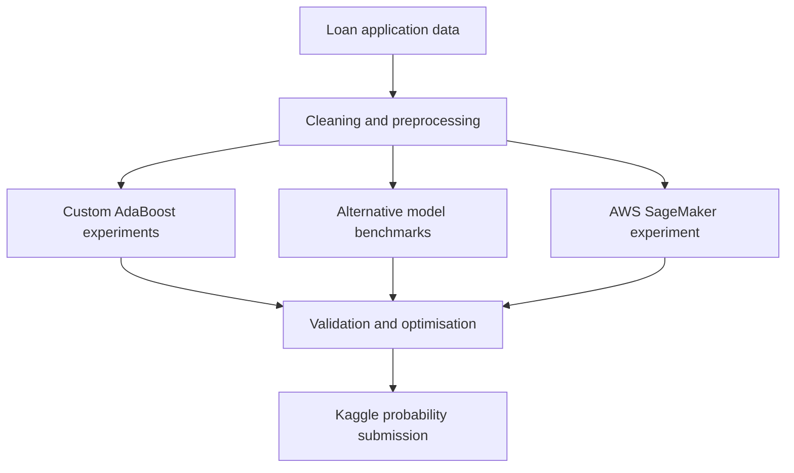

# Loan Approval Prediction: AdaBoost, Model Benchmarking and AWS

This project explores loan approval prediction through a from-scratch implementation of AdaBoost, model benchmarking, feature engineering, hyperparameter tuning, ensemble optimisation, probability calibration, and cloud-based experimentation with AWS.

> **Academic context:** This was completed as an individual university assignment for the Applied Machine Learning and Big Data Processing course within my Graduate Diploma in Information Sciences at Massey University. It is published as a portfolio demonstration of my learning and technical work.

## Project highlights

- Implemented the core AdaBoost algorithm from scratch using NumPy rather than the built-in scikit-learn AdaBoost classifier.
- Analysed ensemble margins, alternative weak learners, difficult-example weighting, decision thresholds, and post-training pruning.
- Built a reusable preprocessing workflow for numerical and categorical loan features.
- Conducted feature-selection and hyperparameter experiments using stratified cross-validation and ROC AUC.
- Compared Gaussian Naive Bayes, k-Nearest Neighbours, Decision Tree, Random Forest, and custom AdaBoost models.
- Achieved a **0.90158 Kaggle score with custom AdaBoost**, placing **9th in the class competition**.
- Used Amazon S3 and SageMaker for a separate cloud-based Random Forest experiment.

## Problem and dataset

The goal is to estimate the probability that a loan application belongs to the positive `loan_status` class. The project uses the [Kaggle Playground Series S4E10 Loan Approval Prediction dataset](https://www.kaggle.com/competitions/playground-series-s4e10).

| Dataset | Rows | Columns | Purpose |
|---|---:|---:|---|
| Training data | 58,645 | 13 | Model training and validation, including the target |
| Kaggle test data | 39,098 | 12 | Final probability predictions |

The training target is imbalanced: approximately **14.24%** of observations belong to the positive loan-status class. For this reason, ROC AUC was used alongside accuracy when comparing models.

The predictors cover applicant characteristics, employment, home ownership, loan purpose and grade, requested amount, interest rate, income ratio, previous default status, and credit-history length.

## Project workflow



## 1. AdaBoost implementation from scratch

The first part of the assignment builds AdaBoost using threshold-based decision stumps. The implementation includes:

- equal initial sample weights;
- weighted-error calculation for candidate stumps;
- weak-learner weight calculation using alpha;
- exponential sample-weight updates;
- weight normalisation;
- weighted ensemble scores and predictions; and
- margin calculation for evaluating prediction confidence.

On a two-feature synthetic classification dataset containing 200 observations, the 30-learner model achieved:

| Metric | Result |
|---|---:|
| Training accuracy | 0.9933 |
| Test accuracy | 0.9600 |
| Test observations with a positive margin | 96% |
| Positive-class F1 at the default threshold | 0.9545 |

### Additional AdaBoost experiments

- **Weak learners:** Decision trees with maximum depths of 1, 2, and 3 each achieved 0.98 test accuracy, compared with 0.96 for the original threshold stump.
- **Difficult examples:** Increasing the additional focus multiplier from 1.00 to 1.50 did not improve the 0.96 test accuracy.
- **Decision threshold:** The default threshold of 0.00 produced the strongest balance in this experiment, with 0.96 accuracy and a positive-class F1 of approximately 0.9545.
- **Ensemble pruning:** Validation-based pruning retained 14 of 50 weak classifiers. The pruned ensemble achieved 0.950 test accuracy, compared with 0.925 for the full ensemble, while removing 72% of its weak learners.

## 2. Kaggle competition with custom AdaBoost

The custom AdaBoost workflow was extended to the loan dataset using median imputation for numerical variables, most-frequent imputation and one-hot encoding for categorical variables, and an optimised cached stump search.

Four interpretable features were engineered:

- `loan_interest_burden`
- `loan_income_ratio_calc`
- `credit_history_age_ratio`
- `employment_age_ratio`

Feature subsets, numbers of boosting rounds, and learning rates were compared with stratified cross-validation.

| AdaBoost experiment | Result |
|---|---:|
| Best feature subset | 11 raw + 4 engineered features |
| Feature-subset mean 3-fold ROC AUC | 0.91329 |
| Best boosting configuration | 60 rounds, learning rate 1.0 |
| Final mean 5-fold ROC AUC | 0.91895 |
| Cross-validation standard deviation | 0.00538 |
| Kaggle score | 0.90158 |
| Class ranking | 9th |

Probability calibration retained the same ROC AUC while slightly improving both the Brier score and log loss. The calibrated custom model was then fitted to the complete training dataset and used to produce the included Kaggle submission probabilities.

## 3. Alternative algorithm benchmarking

The project also compared four scikit-learn classifiers using a consistent preprocessing and validation workflow.

| Model | Best setting | Validation accuracy | Validation ROC AUC |
|---|---|---:|---:|
| Gaussian Naive Bayes | Baseline | 0.8679 | 0.8746 |
| k-Nearest Neighbours | `n_neighbors=15` | 0.9343 | 0.9020 |
| Decision Tree | `max_depth=10`, `min_samples_leaf=5` | 0.9475 | 0.9134 |
| Random Forest | `n_estimators=300`, `max_depth=12` | **0.9505** | **0.9353** |

The tuned Random Forest produced the strongest local validation ROC AUC. An important finding was that adding the four engineered features did not improve its performance: the original 11 predictors achieved a ROC AUC of 0.93527, compared with 0.93318 using the combined feature set. This demonstrates why engineered features should be tested rather than assumed to be beneficial.

## 4. AWS experiment

A separate notebook reproduces a smaller modelling workflow in Amazon SageMaker:

1. Created a SageMaker session and accessed the project data stored in Amazon S3.
2. Downloaded and validated the training dataset.
3. Selected seven numerical predictors.
4. Created a stratified 80/20 training and validation split.
5. Trained a baseline Random Forest classifier.
6. Compared combinations of `n_estimators` and `max_depth` using validation ROC AUC.

| AWS experiment | ROC AUC |
|---|---:|
| Baseline Random Forest | 0.8975 |
| Best tuned Random Forest (`n_estimators=50`, `max_depth=10`) | 0.9117 |

This part demonstrates basic experience using SageMaker notebooks, S3 data storage, boto3, and cloud-based model experimentation.

## Technologies and skills demonstrated

- Python, NumPy, pandas and Matplotlib
- scikit-learn pipelines and `ColumnTransformer`
- Missing-value imputation and one-hot encoding
- AdaBoost algorithm implementation
- Classification margins and ensemble pruning
- Feature engineering and feature-selection experiments
- Stratified train/validation splitting and cross-validation
- Accuracy, F1, ROC AUC, Brier score and log-loss evaluation
- Hyperparameter tuning and experiment comparison
- Probability calibration
- Kaggle submission preparation
- Amazon SageMaker, Amazon S3 and boto3

## Repository contents

```text

├── Assignment 1 Notebook.ipynb       # Main analysis and modelling workflow
├── Task4_AWS_ML.ipynb                # AWS SageMaker experiment
└── playground-series-s4e10/
    ├── train.csv
    ├── test.csv
    ├── sample_submission.csv
    └── submission.csv
```


## Running the project

### 1. Create and activate a virtual environment

```bash
python -m venv .venv
```

Windows:

```powershell
.venv\Scripts\activate
```

macOS or Linux:

```bash
source .venv/bin/activate
```

### 2. Install the local notebook dependencies

```bash
pip install numpy pandas matplotlib scikit-learn jupyter
```

For the AWS notebook, also install:

```bash
pip install boto3 sagemaker joblib
```

### 3. Start Jupyter

```bash
jupyter lab
```

Open `Assignment 1 Notebook.ipynb` for the main workflow or `Task4_AWS_ML.ipynb` for the cloud experiment.

### Data-path note

The submitted notebooks retain computer-specific paths from the original assignment. To run them after cloning the repository, update the path variables to use the included data directory:

```python
from pathlib import Path

DATA_DIR = Path("playground-series-s4e10")
TRAIN_PATH = DATA_DIR / "train.csv"
TEST_PATH = DATA_DIR / "test.csv"
SUBMISSION_PATH = DATA_DIR / "sample_submission.csv"
```

## Key lessons

- High training accuracy does not guarantee strong performance on unseen data.
- ROC AUC is more informative than accuracy alone when the target is imbalanced.
- Increasing model complexity or adding features does not automatically improve generalisation.
- Ensemble pruning can reduce model size without reducing performance and may sometimes improve it.
- Consistent preprocessing and evaluation are essential for fair model comparison.

## Limitations

- Task 1 uses a small synthetic dataset, so its accuracy does not represent real lending performance.
- The Kaggle data are designed for a competition and should not be treated as a production lending dataset.
- The positive target class is underrepresented, which can make accuracy appear stronger than minority-class performance.
- Local validation and Kaggle leaderboard scores do not establish fairness, robustness, or suitability for real credit decisions.
- The project does not include fairness analysis, explainability checks, deployment monitoring, or production governance.

## Responsible use

This project is for education and portfolio demonstration only. It must not be used to approve or decline real loans. Real lending systems require appropriate consent, privacy protection, explainability, bias and fairness testing, human oversight, regulatory review, and ongoing monitoring.

The Kaggle data remain subject to the competition's terms. Check those terms before redistributing the source datasets.

## Author

**Sumit Uniyal**  
Graduate Diploma in Information Sciences, Massey University  
[GitHub profile](https://github.com/Sumit42code)

